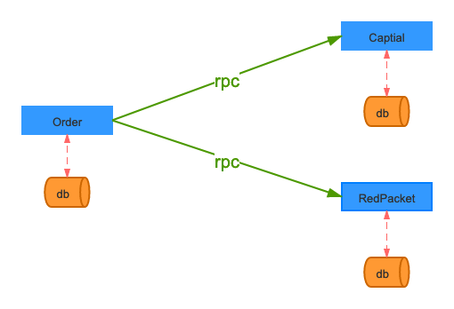

# 快速开始
让我们从一个微服务示例开始!  

## 示例说明
用户购买商品的业务逻辑。整个业务逻辑由3个微服务提供支持：资金服务、红包服务、订单服务。 
    
**执行流程**  
try阶段正常，则执行confirm阶段，try阶段异常，则执行cancle阶段。  
- try阶段
> 1、订单服务(订单状态为DRAFT)，调用资金服务下单，调用红包服务下单  
> 2、资金服务生成订单并扣除资金账户余额  
> 3、红包服务生成订单并扣除红包余额   

- confirm阶段
> 1、订单服务更新订单状态为CONFIRMED   
> 2、资金服务更新订单状态为CONFIRM   
> 3、红包服务更新订单状态为CONFIRM   

- cancel阶段
> 1、订单服务更新订单状态为PAY_FAILED   
> 2、资金服务更新订单状态为CANCEL并归还资金账户余额    
> 3、红包服务更新订单状态为CANCEL并归还 红包余额  

### 微服务部署架构图
  

   
### 红包服务
```java
public interface RedPacketTradeOrderService {
    @EnableTcc
    public String record(RedPacketTradeOrderDto tradeOrderDto);
}
```

### 资金服务
```java
public interface CapitalTradeOrderService {
    @EnableTcc
    public String record(CapitalTradeOrderDto tradeOrderDto);
}
```

### 订单服务
主要业务逻辑如下：
```java
package org.mengyun.tcctransaction.sample.dubbo.order.service;
@Service
public class PaymentServiceImpl {
    @Autowired
    CapitalTradeOrderService capitalTradeOrderService;
    @Autowired
    RedPacketTradeOrderService redPacketTradeOrderService;
    @Autowired
    OrderRepository orderRepository;
    @Compensable(confirmMethod = "confirmMakePayment", cancelMethod = "cancelMakePayment", asyncConfirm = false)
    public void makePayment(@UniqueIdentity String orderNo) {
        System.out.println("order try make payment called.time seq:" + DateFormatUtils.format(Calendar.getInstance(), "yyyy-MM-dd HH:mm:ss"));
        Order order = orderRepository.findByMerchantOrderNo(orderNo);
        String result = capitalTradeOrderService.record(buildCapitalTradeOrderDto(order));
        String result2 = redPacketTradeOrderService.record(buildRedPacketTradeOrderDto(order));
    }
    public void confirmMakePayment(String orderNo) {
        System.out.println("order confirm make payment called. time seq:" + DateFormatUtils.format(Calendar.getInstance(), "yyyy-MM-dd HH:mm:ss"));
        Order foundOrder = orderRepository.findByMerchantOrderNo(orderNo);
        //check if the trade order status is PAYING, if no, means another call confirmMakePayment happened, return directly, ensure idempotency.
        if (foundOrder != null) {
            foundOrder.confirm();
            orderRepository.update(foundOrder);
        }
    }
    public void cancelMakePayment(String orderNo) {
        System.out.println("order cancel make payment called.time seq:" + DateFormatUtils.format(Calendar.getInstance(), "yyyy-MM-dd HH:mm:ss"));
        Order foundOrder = orderRepository.findByMerchantOrderNo(orderNo);
        //check if the trade order status is PAYING, if no, means another call cancelMakePayment happened, return directly, ensure idempotency.
        if (foundOrder != null) {
            foundOrder.cancelPayment();
            orderRepository.update(foundOrder);
        }
    }
}

```


## 示例演示
[embedded模式示例](/zh-cn/docs/tutorial/quickstart/embedded-sample.html)  
[server模式示例](/zh-cn/docs/tutorial/quickstart/server-sample.html)  


