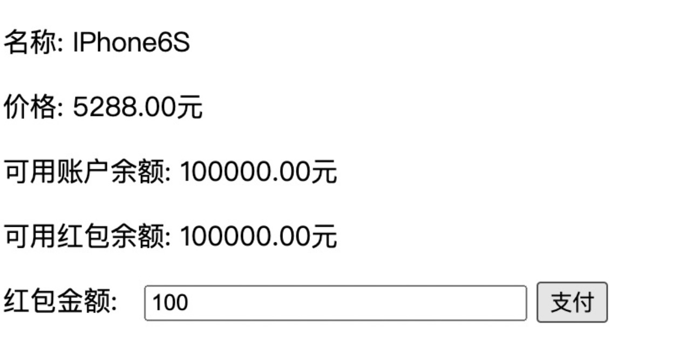
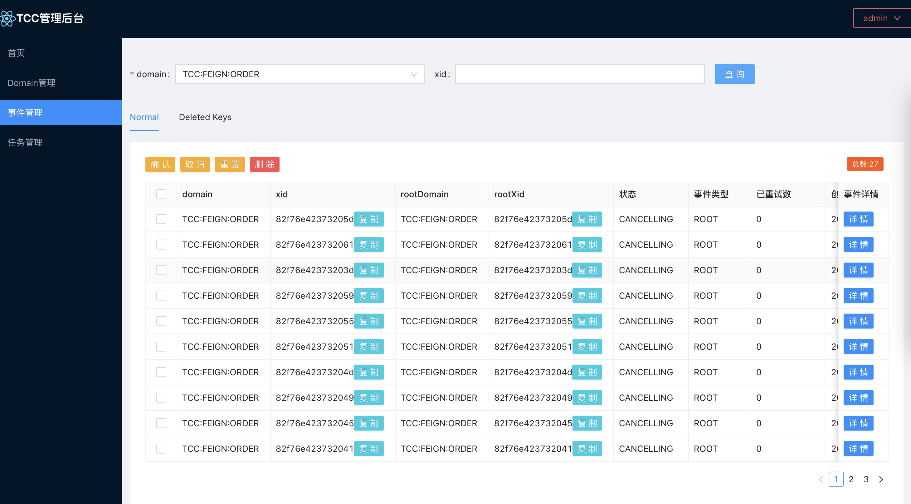

# server模式示例
这里用http-sample来介绍如何使用tcc-transaction的[**server模式**](/zh-cn/docs/tutorial/storagemode/server.html)  
示例工程:[tcc-transaction-http-sample](https://github.com/changmingxie/tcc-transaction/tree/master-2.x/tcc-transaction-tutorial-sample/tcc-transaction-http-sample) 
> tcc-transaction-http-capital(资金服务)  
> tcc-transaction-http-redpacket(红包服务)  
> tcc-transaction-http-order(订单服务)   
 
**sample特征**：
- 采用openfeigin的远程调用方式    
- springboot启动，application.yaml配置tcc  
- 采用tcc-transaction的server模式

架构图 TODO

以下将一步一步教大家如何使用tcc-transaction的server模式    
**步骤如下**
- server部署  
- dashboard部署  
- 资金服务开发  
- 红包服务开发  
- 订单服务开发  
- 功能演示  

## server部署
详见[server单机部署](/zh-cn/docs/ops/server/deploy-alone.html)  
这里以注册中心[direct]+存储类型[memory]+任务部署类型[quartz集群模式]的组合，application.yaml可如下配置：  
```yaml
server:
  port: 12332
logging:
  level:
    root: info
spring:
  application:
    name: tcc-transaction-server
  tcc:
    storage:
      storage-type: memory
      max-attempts: 1
    recovery:
      quartz-clustered: true
      quartz-data-source-url: jdbc:mysql://localhost:3306/TCC_SERVER?useSSL=false&allowPublicKeyRetrieval=true
      quartz-data-source-driver: com.mysql.jdbc.Driver
      quartz-data-source-user: root
      quartz-data-source-password: welcome1
    registry:
      registry-type: direct
      cluster-name: default
    remoting:
      listen-port: 2332

```
## dashboard部署
详见[dashboard之server模式部署](/zh-cn/docs/ops/dashboard/deploy-server.html)  
注册中心采用direct方式，application.yaml配置可如下
```yaml
server:
  servlet:
    context-path: /tcc-transaction-dashboard
  port: 22332

logging:
  level:
    root: info
spring:
  application:
    name: tcc-transaction-dashboard
  tcc:
    dashboard:
      userName: admin
      password: 123456
      data-fetch-type: tccserver
      registry: # data-fetch-type为server时使用
        registry-type: direct
        direct:
          server-addresses: http://localhost:12332
    recovery:
      quartz-clustered: true
      quartz-data-source-url: jdbc:mysql://localhost:3306/TCC_SERVER?useSSL=false&allowPublicKeyRetrieval=true
      quartz-data-source-driver: com.mysql.jdbc.Driver
      quartz-data-source-user: root
      quartz-data-source-password: welcome1

```
## 资金服务开发
涉及两个模块的开发：  
- tcc-transaction-http-capital-api
- tcc-transaction-http-capital   

### tcc-transaction-http-capital-api开发
这里仅给出了相关dto定义

### tcc-transaction-http-capital开发  
提供资金相关操作实现、服务暴露等功能  
#### 添加maven依赖
请选用[最新版本](https://github.com/changmingxie/tcc-transaction/releases)
```xml
<dependency>
    <groupId>org.mengyun</groupId>
    <artifactId>tcc-transaction-http</artifactId>
    <version>${tcc-transaction.version}</version>
</dependency>

<dependency>
    <groupId>org.mengyun</groupId>
    <artifactId>tcc-transaction-spring-boot-starter</artifactId>
    <version>${tcc-transaction.version}</version>
</dependency>
```


#### application.yaml配置
```yaml
spring:
  main:
    allow-bean-definition-overriding: true
  application:
    name: tcc-transaction-http-capital
  tcc:
    storage:
      storage-type: remoting
      domain: "TCC:FEIGN:CAPITAL"
    recovery:
      recovery-enabled: false
    registry:
      registry-type: direct
      cluster-name: default
      direct:
        server-addresses: 127.0.0.1:2332
server:
  port: 8082
  servlet:
    context-path: /${spring.application.name}
logging:
  level:
    root: info
```
#### tcc实现
在tcc实现上方法上添加[@Compensable](/zh-cn/docs/tutorial/api.html#%40compensable)注解，设置confirmMethod和cancelMethod方法，分别为tcc的confirm和cancel方法。    
**特别注意**：confirm和cancel方法参数要与try保持一致。  

```java
@RestController
public class CapitalController {

    @RequestMapping(value = "/tradeOrder/record", method = RequestMethod.POST)
    @Compensable(confirmMethod = "confirmRecord", cancelMethod = "cancelRecord")
    public String record(@RequestBody CapitalTradeOrderDto tradeOrderDto) {
        // do something ...
        return "success";
    }
    public void confirmRecord(CapitalTradeOrderDto tradeOrderDto) {
        // do something ...
    }
    public void cancelRecord(CapitalTradeOrderDto tradeOrderDto) {
        // do something ...
    }
}


```
## 红包服务开发
涉及两个模块的开发：  
- tcc-transaction-http-redpacket-api   
- tcc-transaction-http-redpacket     

### tcc-transaction-http-redpacket-api开发
这里仅给出了相关dto定义  

### tcc-transaction-http-redpacket开发  
提供红包相关操作实现、服务暴露等功能  
#### 添加maven依赖

请选用[最新版本](https://github.com/changmingxie/tcc-transaction/releases)
```xml
<dependency>
    <groupId>org.mengyun</groupId>
    <artifactId>tcc-transaction-http</artifactId>
    <version>${tcc-transaction.version}</version>
</dependency>

<dependency>
    <groupId>org.mengyun</groupId>
    <artifactId>tcc-transaction-spring-boot-starter</artifactId>
    <version>${tcc-transaction.version}</version>
</dependency>
```

#### application.yaml配置
```yaml
spring:
  main:
    allow-bean-definition-overriding: true
  application:
    name: tcc-transaction-http-capital
  tcc:
    storage:
      storage-type: remoting
      domain: "TCC:FEIGN:REDPACKET"
    recovery:
      recovery-enabled: false
    registry:
      registry-type: direct
      cluster-name: default
      direct:
        server-addresses: 127.0.0.1:2332
server:
  port: 8082
  servlet:
    context-path: /${spring.application.name}
logging:
  level:
    root: info
```

#### tcc实现
在tcc实现上方法上添加[@Compensable](/zh-cn/docs/tutorial/api.html#%40compensable)注解，设置confirmMethod和cancelMethod方法，分别为tcc的confirm和cancel方法。    
**特别注意**：confirm和cancel方法参数要与try保持一致。  

```java
@RestController
public class RedpacketController {
    @RequestMapping(value = "/tradeOrder/record", method = RequestMethod.POST)
    @Compensable(confirmMethod = "confirmRecord", cancelMethod = "cancelRecord")
    public String record(@RequestBody RedPacketTradeOrderDto tradeOrderDto) {
        // do something...
        return "success";
    }

    @Transactional
    public void confirmRecord(RedPacketTradeOrderDto tradeOrderDto) {
        // do something...
    }

    @Transactional
    public void cancelRecord(RedPacketTradeOrderDto tradeOrderDto) {
        // do something...
    }
}

```
## 订单服务开发  
提供下单支付相关功能，只有一个模块tcc-transaction-http-order   

### tcc-transaction-http-order开发  
提供下单支付相关功能   

#### 添加maven依赖
请选用[最新版本](https://github.com/changmingxie/tcc-transaction/releases)
```xml
<dependency>
    <groupId>org.mengyun</groupId>
    <artifactId>tcc-transaction-http</artifactId>
    <version>${tcc-transaction.version}</version>
</dependency>

<dependency>
    <groupId>org.mengyun</groupId>
    <artifactId>tcc-transaction-spring-boot-starter</artifactId>
    <version>${tcc-transaction.version}</version>
</dependency>
```


#### application.yaml配置
```yaml
spring:
  main:
    allow-bean-definition-overriding: true
  application:
    name: tcc-transaction-http-capital
  tcc:
    storage:
      storage-type: remoting
      domain: "TCC:FEIGN:ORDER"
    recovery:
      recovery-enabled: false
    registry:
      registry-type: direct
      cluster-name: default
      direct:
        server-addresses: 127.0.0.1:2332
server:
  port: 8082
  servlet:
    context-path: /${spring.application.name}
logging:
  level:
    root: info
```

#### tcc实现
在tcc实现上方法上添加[@Compensable](/zh-cn/docs/tutorial/api.html#%40compensable)注解，设置confirmMethod和cancelMethod方法，分别为tcc的confirm和cancel方法。    
**特别注意**：confirm和cancel方法参数要与try保持一致。    
**PaymentServiceImpl**  
```java
@Service
public class PaymentServiceImpl {
    @Autowired
    private TradeOrderServiceProxy tradeOrderServiceProxy;
    @Autowired
    private OrderRepository orderRepository;

    @Compensable(confirmMethod = "confirmMakePayment", cancelMethod = "cancelMakePayment", asyncConfirm = true)
    @Transactional
    public void makePayment(String orderNo) {
        Order order = orderRepository.findByMerchantOrderNo(orderNo);
        tradeOrderServiceProxy.record(buildCapitalTradeOrderDto(order));
        tradeOrderServiceProxy.record(buildRedPacketTradeOrderDto(order));
    }

    public void confirmMakePayment(String orderNo) {
        // do something ...
    }

    public void cancelMakePayment(String orderNo) {
        // do something ...
    }

}

```
**TradeOrderServiceProxy**
```java
@Component
public class TradeOrderServiceProxy {

    @Autowired
    private CapitalFeignClient capitalFeignClient;

    @Autowired
    private RedPacketFeignClient redPacketFeignClient;

    public String record(CapitalTradeOrderDto tradeOrderDto) {
        return capitalFeignClient.record(tradeOrderDto);
    }

    public String record(RedPacketTradeOrderDto tradeOrderDto) {
        return redPacketFeignClient.record(tradeOrderDto);
    }
}

```

调用capital服务record接口上，添加[@EnableTcc](/zh-cn/docs/tutorial/api.html#%40enabletcc)，来传递上下文
**CapitalFeignClient**
```java
@FeignClient(name = "capital", url = "http://localhost:8082/tcc-transaction-http-capital/")
public interface CapitalFeignClient {
    @EnableTcc
    @RequestMapping(value = "/tradeOrder/record", method = RequestMethod.POST)
    @ResponseBody
    String record(@RequestBody CapitalTradeOrderDto tradeOrderDto);
}

```

调用redpacket服务record接口上，添加[@EnableTcc](/zh-cn/docs/tutorial/api.html#%40enabletcc)，来传递上下文
**RedPacketFeignClient**
```java
@FeignClient(name = "redPacket", url = "http://localhost:8083/tcc-transaction-http-redpacket/")
public interface RedPacketFeignClient {
    @EnableTcc
    @RequestMapping(value = "/tradeOrder/record", method = RequestMethod.POST)
    @ResponseBody
    String record(@RequestBody RedPacketTradeOrderDto tradeOrderDto);
}

```


## 功能演示
### 本地启动
分别启动tcc-transaction-http-capital、tcc-transaction-http-redpacket、tcc-transaction-http-order

 
#### 测试页面演示
测试页面入口：http://localhost:8081 
  
选择购买商品

点击支付按钮

#### 日志演示
注意调用的先后顺序。 
try阶段
```text
1、order try make payment called.time seq:2022-07-13 17:46:04
2、capital try record called. time seq:2022-07-13 17:46:06
3、red packet try record called. time seq:2022-07-13 17:46:07
```
confirm阶段
```text
1、order confirm make payment called. time seq:2022-07-13 17:46:08
2、capital confirm record called. time seq:2022-07-13 17:46:09
3、red packet confirm record called. time seq:2022-07-13 17:46:10
```

#### dashboard演示
访问地址：http://localhost:22332/tcc-transaction-dashboard   
默认用户: admin   
默认密码：123456  
详细操作参考[dashboard使用手册](/zh-cn/docs/ops/dashboard/dashboard-guild.html)   
  
**首页**  
登录成功后进入首页   
  
 
**Domain管理**   
资金、红包、订单这三个服务启动，会自动注册domain    
  
 
**事件管理**   
出现异常事件，或者发生事件堆积，可以通过事件管理查看，并进行相关操作  
  

**任务管理**  
dashboard server模式比embedded模式多一个任务管理，quartz采用集群模式时，可以对任务进行停止、恢复、修改cron等操作   
  


## 结束

**注意事项**
- TCC事务的confirm和cancel方法的声明必须和try方法入参一致。    
- 如果是作为分支事务提供给上游服务调用时，接口方法必须添加注解@EnableTcc，否则会影响事务上下文传递
- 客户端如果选择server模式，务必先把tcc-server服务启动起来

恭喜你，顺序正确说明http-sample项目运行成功。


